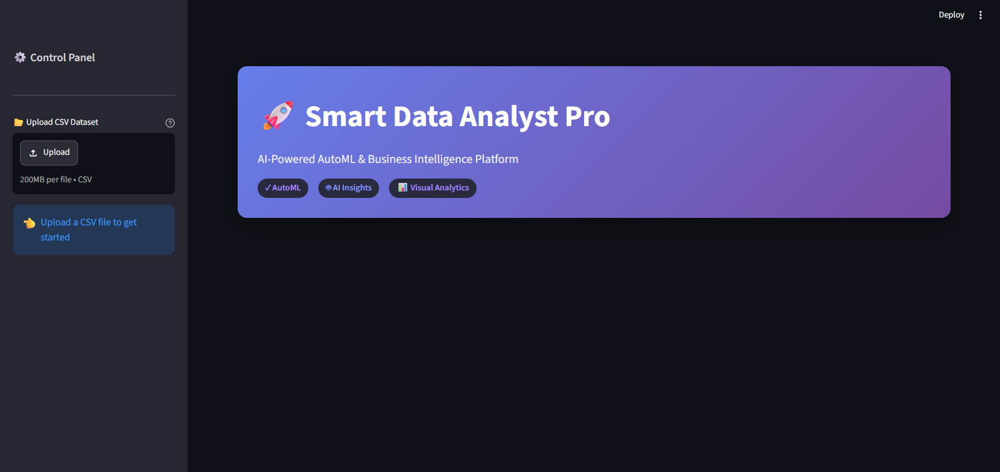
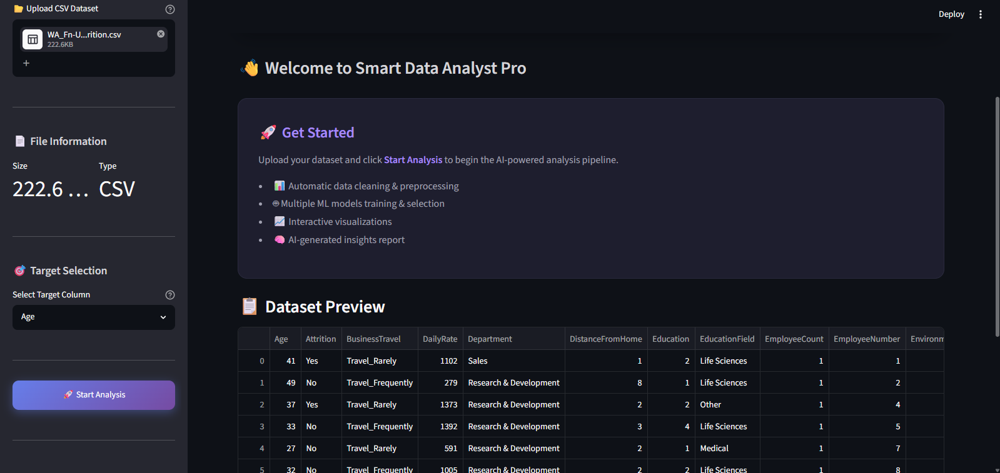
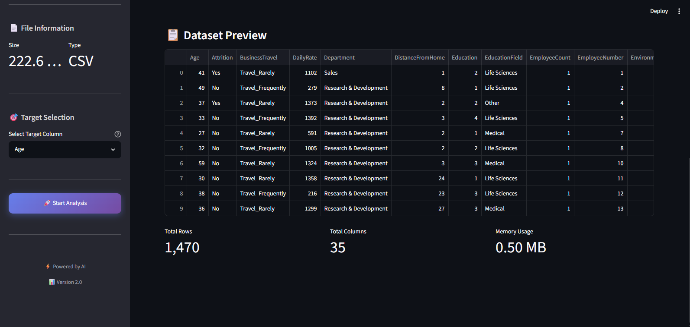
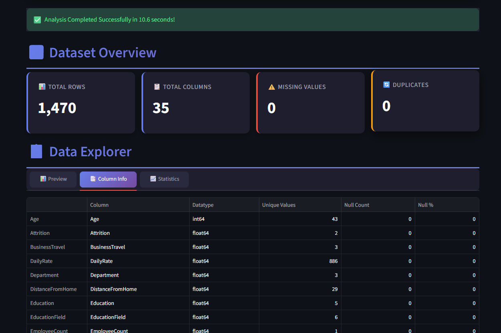
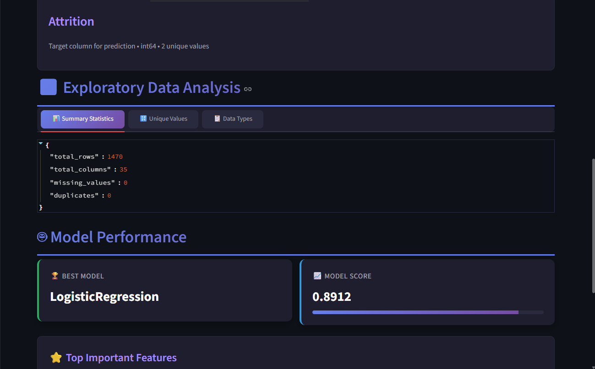
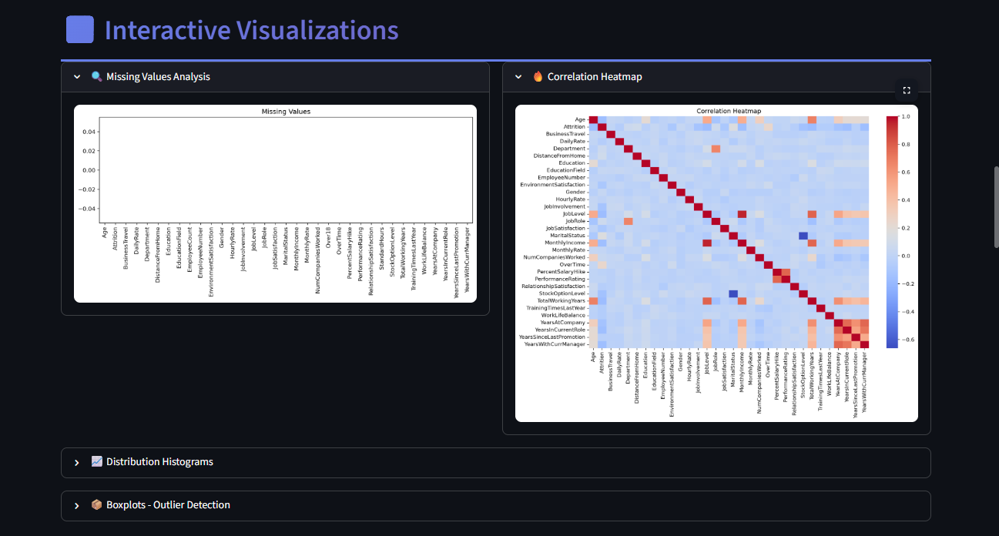
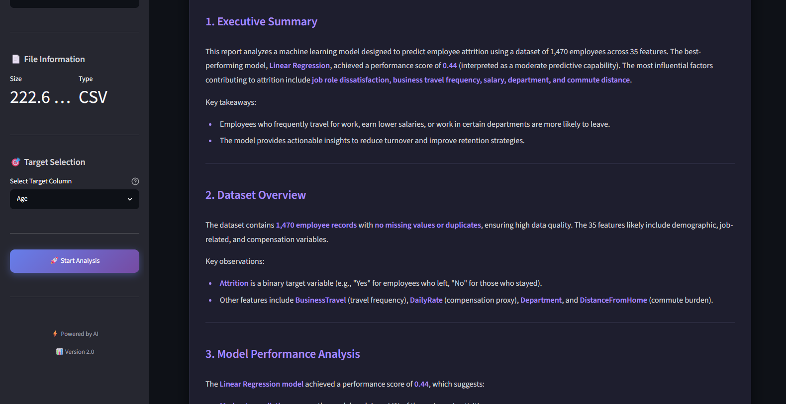

# 🤖 Smart Data Analyst

> **An AI-Powered AutoML & Business Intelligence Platform built with Python, Streamlit, Scikit-learn, LangChain, and Mistral AI.**

Smart Data Analyst is an end-to-end machine learning platform that allows users to upload any CSV dataset and automatically perform:

* 📊 Data Cleaning
* 📈 Exploratory Data Analysis (EDA)
* 📉 Data Visualization
* 🤖 Automatic Machine Learning
* 🏆 Best Model Selection
* 🧠 AI-Powered Business Insight Generation using Mistral AI

---

# 🚀 Features

### 📂 Upload Any CSV Dataset

Simply upload your dataset and let the application perform the complete analysis.

---

### 🧹 Automated Data Cleaning

* Missing Value Handling
* Duplicate Removal
* Label Encoding
* Feature Scaling
* Automatic Data Preprocessing

---

### 📊 Exploratory Data Analysis (EDA)

Automatically generates:

* Dataset Summary
* Missing Values
* Duplicate Values
* Data Types
* Unique Values
* Numerical Statistics
* Correlation Matrix

---

### 📈 Interactive Data Visualization

Visualizations include:

* Correlation Heatmap
* Missing Value Graph
* Histograms
* Boxplots
* Distribution Analysis

---

### 🤖 Automatic Machine Learning

The system automatically detects whether the uploaded dataset is:

* Classification
* Regression

Then trains multiple machine learning models and compares them.

Current Models:

#### Classification

* Logistic Regression
* Random Forest Classifier

#### Regression

* Linear Regression
* Random Forest Regressor

---

### 🏆 Best Model Selection

Automatically compares all trained models and selects the best-performing model.

Displays:

* Best Model
* Model Accuracy / R² Score
* Feature Importance

---

### 🧠 AI Report Generation

Using **LangChain + Mistral AI**, the application automatically generates a professional business report including:

* Executive Summary
* Dataset Overview
* Machine Learning Performance
* Important Features
* Business Insights
* Recommendations
* Risks
* Final Conclusion

---

# 🛠️ Tech Stack

### Programming Language

* Python

### Machine Learning

* Scikit-learn
* Pandas
* NumPy

### Data Visualization

* Matplotlib
* Seaborn

### AI

* LangChain
* Mistral AI

### Frontend

* Streamlit

### Environment

* python-dotenv

### Version Control

* Git
* GitHub

---

# 📂 Project Structure

```text
Smart-Data-Analyst/

│── app.py
│── requirements.txt
│── README.md
│── .env
│
├── data/
│
├── images/
│
├── models/
│
├── reports/
│
├── src/
│   ├── data_loader.py
│   ├── data_cleaner.py
│   ├── eda.py
│   ├── visualizer.py
│   ├── model_trainer.py
│   ├── model_selector.py
│   ├── insight_generator.py
│   └── llm_report_generator.py
│
└── tests/
```

---

# 📸 Application Screenshots

## Dashboard



---

## Dashboard - Header



---

## Dataset Preview



---

## Dataset Overview | Data Explorer



---

## Target-Value | EDA | Model-Performance



---

## Interactive Visualization



---

## AI Generated Summary



---

# ⚙️ Installation

Clone the repository

```bash
git clone https://github.com/YOUR_USERNAME/Smart-Data-Analyst.git
```

Move into the project directory

```bash
cd Smart-Data-Analyst
```

Install dependencies

```bash
pip install -r requirements.txt
```

Create a `.env` file

```env
MISTRAL_API_KEY=your_api_key_here
```

Run the application

```bash
streamlit run app.py
```

---

# 🎯 Future Improvements

* XGBoost Integration
* LightGBM Integration
* CatBoost Integration
* Hyperparameter Tuning
* Automated Feature Engineering
* PDF Report Export
* Multiple Dataset Support
* Model Explainability (SHAP/LIME)
* Cloud Deployment
* User Authentication

---

# ⭐ Why This Project?

This project demonstrates practical experience in:

* Data Cleaning
* Data Analysis
* Data Visualization
* Machine Learning
* AutoML
* Prompt Engineering
* LangChain
* LLM Integration
* Streamlit Development
* Git & GitHub
* End-to-End AI Application Development

---

# 👨‍💻 Author

**Akash Patel**

AI & Machine Learning Developer

GitHub: https://github.com/ap88020

---

## ⭐ If you found this project useful, consider giving it a Star!
